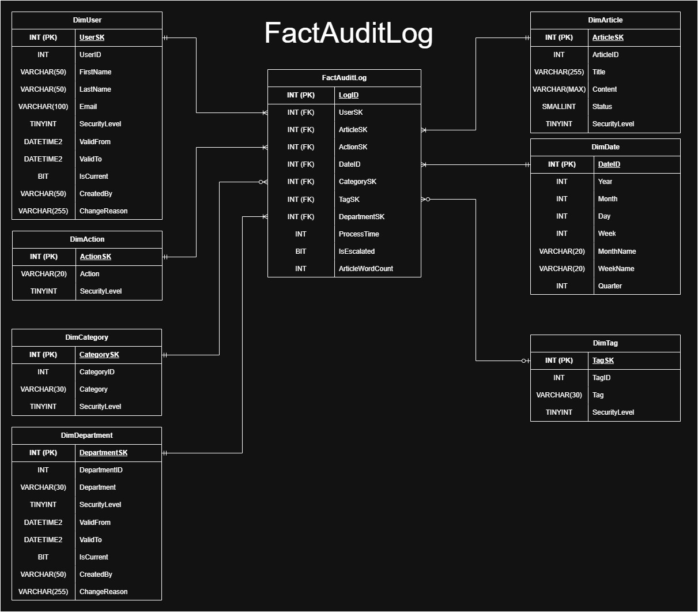
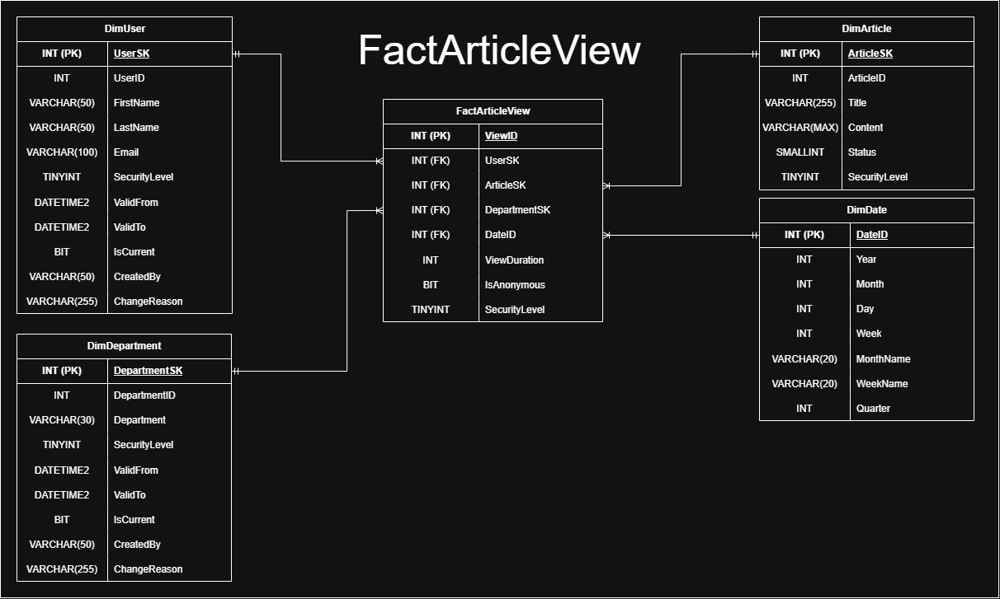
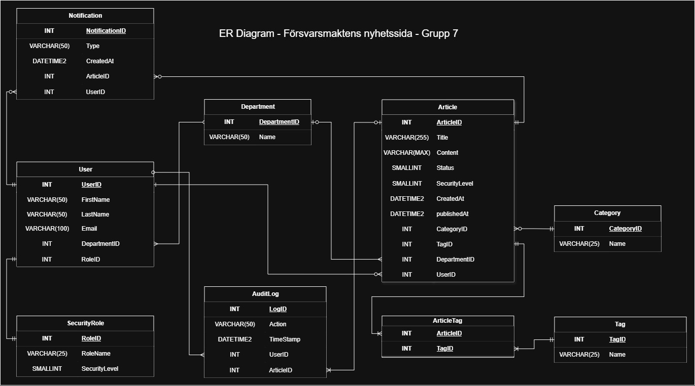

# Dimensional Modeling Assignment — DE25

**Author:** Christofer Lindholm  
**Case:** Försvarsmaktens Nyhetssystem (Swedish Armed Forces News System)  
**Engine:** SQL Server 2019+ / SSMS  
**Course:** Data Engineering 25 — Individual Assignment

---

## Live Front

**[dimensional-modeling-assignment-christofer.lovable.app](https://dimensional-modeling-assignment-christofer.lovable.app/)**

An interactive presentation of the project built with Lovable.

---

## Project Overview

This assignment models a **data warehouse** for a fictional internal news system used by the Swedish Armed Forces. The system tracks article editorial workflow and readership, enabling analytical queries on content performance, workflow efficiency, and security compliance.

The source system (OLTP) was designed in a prior group project. This assignment takes that source, defines a dimensional model on top of it, and implements a full star schema with ETL loading.

---

## Star Schema






### Fact Tables

| Table | Grain | Key Measures |
|-------|-------|-------------|
| `FactAuditLog` | One row per editorial workflow event | `ProcessTime` (seconds, additive), `IsEscalated` (security mismatch flag, semi-additive), `ArticleWordCount` (non-additive) |
| `FactArticleView` | One row per article read event | `ViewDuration` (seconds, additive), `IsAnonymous` (semi-additive), `SecurityLevel` (non-additive) |

### Dimension Tables

| Table | SCD Type | Description |
|-------|----------|-------------|
| `DimDate` | Type 0 — static | Pre-populated 2020–2030; DateID format `YYYYMMDD` |
| `DimAction` | Type 0 — static | Editorial actions (Draft, Submit, Review, Approve, Reject, RequestChange, Publish) with security level mapping |
| `DimCategory` | Type 1 — overwrite | Article categories; history not tracked |
| `DimTag` | Type 1 — overwrite | Article tags; history not tracked |
| `DimArticle` | Type 1 — overwrite | Article metadata; latest version kept |
| `DimUser` | Type 2 — full history | `ValidFrom` / `ValidTo` / `IsCurrent`; includes sentinel row (UserSK = -1) for anonymous readers |
| `DimDepartment` | Type 2 — full history | `ValidFrom` / `ValidTo` / `IsCurrent`; includes sentinel row (DepartmentSK = -1) for unknown |

**SCD rationale:** Users and departments are tracked with SCD Type 2 because historical accuracy matters — a security escalation event should reflect the user's clearance level *at the time of the event*, not today's level. Categories, tags, and articles use Type 1 because the current value is sufficient for analysis.

---

## Source Model (OLTP)



The source database `TestDataDB` contains:

| Table | Description |
|-------|-------------|
| `Department` | Five departments (Press, Technology, HR, Finance, Marketing) |
| `SecurityRole` | 16 military/civilian ranks mapped to security levels 0–15 |
| `User` | Internal users with department and role |
| `Article` | News articles with status, security level, category and tag |
| `AuditLog` | One row per workflow action on an article |
| `ViewLog` | One row per article read, `UserID` nullable for anonymous readers |
| `Category` / `Tag` / `ArticleTag` | Classification tables |
| `Notification` | Workflow event notifications |

Security levels are modelled on Swedish military OR/OF ranks:

| Level | Rank |
|-------|------|
| 0 | Civilian |
| 1 | Menig (OR 1–2) |
| 3 | Sergeant (OR 6) |
| 8 | Kapten (OF 2) |
| 15 | General (OF 9) |

---

## Repository Files

| File | Description |
|------|-------------|
| `test_db_create_and_seed.sql` | Creates `TestDataDB` with all OLTP tables, indexes, constraints and seed data (10 articles, 10 users, full audit trail, anonymous view logs). **Run first.** |
| `assignment_create_and_load.sql` | Creates `DDNews` star schema (dimensions + facts + FK constraints + indexes), then ETL-loads from `TestDataDB`. **Run second.** |
| `er_diagram.jpg` | Source OLTP entity–relationship diagram |
| `fact_audit_log_star_schemas_dark.jpg` | Star schema diagram — FactAuditLog and its dimensions |
| `fact_article_view_star_schemas_dark.jpg` | Star schema diagram — FactArticleView and its dimensions |
| `dokumentation.docx` | Full written report covering Steps 1–8: business understanding, grain definition, SCD reasoning, source-to-target mapping, and reflection |
| `assignment.pdf` | The original assignment brief |

---

## How to Run

**Prerequisites:** SQL Server 2019+ instance with SSMS (or `sqlcmd`).

**Step 1 — Source database**

Open and execute `test_db_create_and_seed.sql`.  
This creates `TestDataDB` and seeds it with:
- 5 departments, 16 security roles, 10 users
- 10 articles across full workflow states (Draft → Published)
- 36 audit log events
- 20 view log entries (mix of authenticated and anonymous)

**Step 2 — Data warehouse**

Open and execute `assignment_create_and_load.sql`.  
This creates `DDNews`, builds the star schema, and ETL-loads all tables from `TestDataDB`. The script ends with two verification queries:

```sql
-- Workflow analysis: avg process time per department/action
SELECT dd.Department, dact.Action, COUNT(*) AS EventCount,
       AVG(f.ProcessTime) AS AvgProcessTimeSec,
       SUM(CAST(f.IsEscalated AS INT)) AS EscalatedEvents
FROM FactAuditLog f
JOIN DimDepartment dd   ON f.DepartmentSK = dd.DepartmentSK
JOIN DimAction     dact ON f.ActionSK     = dact.ActionSK
GROUP BY dd.Department, dact.Action
ORDER BY dd.Department, dact.Action;

-- Readership: total views, anonymous vs authenticated, avg duration
SELECT da.Title, COUNT(*) AS TotalViews,
       SUM(CAST(fv.IsAnonymous AS INT)) AS AnonymousViews,
       SUM(CAST(1 - fv.IsAnonymous AS INT)) AS AuthenticatedViews,
       AVG(fv.ViewDuration) AS AvgDurationSec
FROM FactArticleView fv
JOIN DimArticle da ON fv.ArticleSK = da.ArticleSK
GROUP BY da.Title
ORDER BY TotalViews DESC;
```

---

## Design Decisions

**Anonymous reader handling** — `ViewLog.UserID` is nullable (external/unauthenticated readers). Rather than using nullable foreign keys in the fact table, both `DimUser` and `DimDepartment` contain a sentinel row (SK = -1) representing "Anonymous / Unknown". `FactArticleView` maps all anonymous views there. This keeps all FK columns `NOT NULL` and avoids NULL-handling in queries.

**Security escalation flag** — `FactAuditLog.IsEscalated` is set to `1` when the acting user's security level is lower than the article's required security level. This enables compliance reporting without joining back to the dimension tables in every query.

**ProcessTime measure** — Computed at ETL time as `DATEDIFF(SECOND, Article.CreatedAt, AuditLog.TimeStamp)`. Additive across events; useful for identifying bottlenecks in the editorial workflow.

**DimDate pre-population** — A recursive CTE generates one row per day from 2020-01-01 to 2030-12-31 (4018 rows). DateID uses the `YYYYMMDD` integer format for compact storage and fast range filtering.
